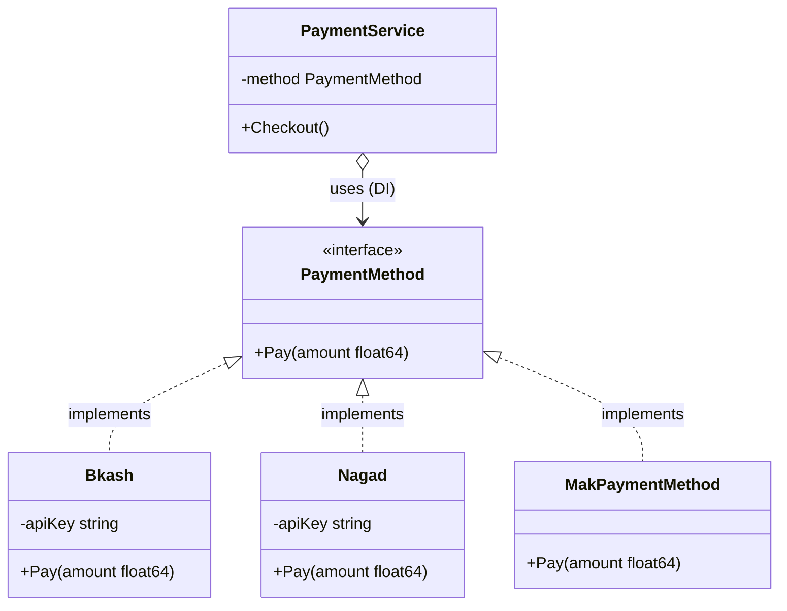

# 🚀 GoFlow — Complete Go (Golang) Fundamentals & Architecture Guide

[](https://go.dev/)
[]()
[]()
[]()

Welcome to **GoFlow** — a comprehensive, hands-on repository and reference handbook designed for mastering **Go (Golang)**. This repository starts from fundamental syntax and control flow, progresses through memory mechanics with pointers and slices, and elevates into real-world software design patterns including **Interface Polymorphism**, **Dependency Injection (DI)**, **Strategy Pattern**, and **Modular Package Architectures**.

---

## 📑 Table of Contents

- [📁 Repository Architecture](#-repository-architecture)
- [🧩 Architecture & Interface Design (UML / Flow)](#-architecture--interface-design-uml--flow)
- [🧠 Topic Breakdown & Code Walkthrough](#-topic-breakdown--code-walkthrough)
  - [1. Root Orchestrator & CLI Styling (`main.go`)](#1-root-orchestrator--cli-styling-maingo)
  - [2. Modular Payment Architecture (`payment/payment.go`)](#2-modular-payment-architecture-paymentpaymentgo)
  - [3. Decoupled Mocking & Duck Typing (`test/test.go`)](#3-decoupled-mocking--duck-typing-testtestgo)
  - [4. Interfaces & Polymorphic Dispatch (`interface/`)](#4-interfaces--polymorphic-dispatch-interface)
  - [5. Advanced Interface Strategy Pattern (`more-on-interface/`)](#5-advanced-interface-strategy-pattern-more-on-interface)
  - [6. Empty Interface & Type Assertions (`empty-interface/`)](#6-empty-interface--type-assertions-empty-interface)
  - [7. Variadic Functions & Slice Spreading (`variadic-function/`)](#7-variadic-functions--slice-spreading-variadic-function)
  - [8. Anonymous Functions, Closures & IIFEs (`ananymous-function/`)](#8-anonymous-functions-closures--iifes-ananymous-function)
  - [9. User Input & Pointer Scans (`Scan/`)](#9-user-input--pointer-scans-scan)
  - [10. Conditional Logic (`if-else/`)](#10-conditional-logic-if-else)
  - [11. Switch Statements & Flow Control (`Switch/`)](#11-switch-statements--flow-control-switch)
  - [12. Loops, Iterations & Control Jumps (`for-loop/`)](#12-loops-iterations--control-jumps-for-loop)
  - [13. Fixed-Size Arrays (`Array/`)](#13-fixed-size-arrays-array)
  - [14. Slices & Underlying Arrays (`Slice/`)](#14-slices--underlying-arrays-slice)
  - [15. Pointers & Memory Referencing (`Pointers/`)](#15-pointers--memory-referencing-pointers)
  - [16. Structs & Factory Constructors (`Struct/`)](#16-structs--factory-constructors-struct)
- [📊 Key Go Architectural Comparisons](#-key-go-architectural-comparisons)
- [⚡ How to Run Every Module](#-how-to-run-every-module)
- [💡 Go Best Practices & Common Gotchas](#-go-best-practices--common-gotchas)

---

## 📁 Repository Architecture

Each directory serves as an isolated, self-contained lesson or a modular package:

```bash
golang-fundamentals/
├── Array/                  # Fixed-size arrays, indexing, and iteration
├── Pointers/               # Memory addresses, dereferencing, pass-by-reference
├── Scan/                   # Standard console input via pointers
├── Slice/                  # Dynamic arrays, slicing, append(), len(), and cap()
├── Struct/                 # Composite types, custom structs, and factory functions
├── Switch/                 # Tagged vs tagless switch expressions
├── ananymous-function/     # Anonymous functions, closures, and IIFEs
├── empty-interface/        # Dynamic typing with any / interface{}, type assertions
├── for-loop/               # Standard loops, while-style loops, break, and continue
├── if-else/                # Boolean evaluations, conditional branch grading
├── interface/              # Interface definitions, animal polymorphism (duck typing)
├── more-on-interface/      # In-depth payment method strategy pattern
├── payment/                # Production-grade package: PaymentMethod, Bkash, Nagad, PaymentService
├── test/                   # External mock implementation satisfying PaymentMethod
├── variadic-function/      # Variable arguments (...int), slice unpacking (...mps)
├── main.go                 # Root runner: Dependency Injection & Colorized CLI Output
├── go.mod                  # Go module definition (go 1.27.1)
├── go.sum                  # Checksums for external dependencies (github.com/fatih/color)
└── README.md               # Complete project handbook
```

---

## 🧩 Architecture & Interface Design (UML / Flow)

The application demonstrates **Structural Subtyping (Duck Typing)** and **Inversion of Control**:



> **Key Takeaway:** `PaymentService` does not depend on concrete implementations like `Bkash` or `Nagad`. It depends solely on the `PaymentMethod` abstraction. Any new payment provider (e.g. `MakPaymentMethod` inside the `test` package) can be plugged in without changing a single line inside the `payment` package!

---

## 🧠 Topic Breakdown & Code Walkthrough

---

### 1. Root Orchestrator & CLI Styling (`main.go`)
📁 **File:** [main.go](file:///home/robinryan/Projects/personal/golang-fundamentals/main.go)

Demonstrates package imports, dependency injection orchestration, and terminal formatting with the external `fatih/color` library.

```go
package main

import (
	"golang-fundamentals/payment"
	"golang-fundamentals/test"

	"github.com/fatih/color"
)

func main() {
	bkash := payment.NewBkash("25923DLO")
	paymentService1 := payment.NewPaymentService(bkash)
	paymentService1.Checkout()

	nagad := payment.NewNagad("NAGAD123")
	paymentService2 := payment.NewPaymentService(nagad)
	paymentService2.Checkout()

	mk := &test.MakPaymentMethod{}
	paymentService3 := payment.NewPaymentService(mk)
	paymentService3.Checkout()

	color.Cyan("Prints text in cyan.")
	color.RGB(255, 128, 0).Println("foreground orange")
}
```

#### 🔍 Explanation:
- **Dependency Injection:** We instantiate dependencies (`NewBkash`, `NewNagad`, `&test.MakPaymentMethod{}`) and inject them into `NewPaymentService`.
- **External Dependency:** Demonstrates importing third-party modules (`github.com/fatih/color`) tracked in [go.mod](file:///home/robinryan/Projects/personal/golang-fundamentals/go.mod).

---

### 2. Modular Payment Architecture (`payment/payment.go`)
📁 **File:** [payment/payment.go](file:///home/robinryan/Projects/personal/golang-fundamentals/payment/payment.go)

A clean modular design exhibiting encapsulation and the **Strategy Pattern**.

```go
package payment

import "fmt"

type PaymentMethod interface {
	Pay(amount float64)
}

type Bkash struct {
	apiKey string
}

type Nagad struct {
	apiKey string
}

func (bk *Bkash) Pay(amount float64) {
	fmt.Printf("Paying %.2f using Bkash with API Key: %s\n", amount, bk.apiKey)
}

func (ng *Nagad) Pay(amount float64) {
	fmt.Printf("Paying %.2f using Nagad with API Key: %s\n", amount, ng.apiKey)
}

type PaymentService struct {
	method PaymentMethod
}

func NewNagad(apiKey string) *Nagad {
	return &Nagad{apiKey: apiKey}
}

func NewBkash(apiKey string) *Bkash {
	return &Bkash{apiKey: apiKey}
}

func NewPaymentService(method PaymentMethod) *PaymentService {
	return &PaymentService{method: method}
}

func (ps *PaymentService) Checkout() {
	ps.method.Pay(10000.000)
}
```

#### 🔍 Explanation:
- **Encapsulation:** The fields `apiKey` are unexported (lowercase), preventing external packages from corrupting state.
- **Factory Constructors:** `NewBkash` and `NewNagad` provide clean object initialization.
- **Method Receivers:** `Pay` is attached to pointer receivers `(bk *Bkash)` and `(ng *Nagad)`.

---

### 3. Decoupled Mocking & Duck Typing (`test/test.go`)
📁 **File:** [test/test.go](file:///home/robinryan/Projects/personal/golang-fundamentals/test/test.go)

Demonstrates how Go achieves decoupled mocking without inheritance or `implements` keywords.

```go
package test

import "fmt"

type MakPaymentMethod struct {}

func (mk *MakPaymentMethod) Pay(amount float64) {
	fmt.Printf("Paying %.2f using MakPaymentMethod successfully\n", amount)
}
```

#### 🔍 Explanation:
- `test.MakPaymentMethod` does not import `payment.PaymentMethod`.
- Because it implements the method signature `Pay(amount float64)`, Go's compiler automatically recognizes it as fulfilling the `payment.PaymentMethod` contract.

---

### 4. Interfaces & Polymorphic Dispatch (`interface/`)
📁 **File:** [interface/main.go](file:///home/robinryan/Projects/personal/golang-fundamentals/interface/main.go)

Core demonstration of polymorphism through animal behaviors.

```go
package main

import "fmt"

type Animal interface {
	speak()
} 

type Dog struct{}
type Cat struct{}
type Human struct {
	name string
}

func (d Dog) speak() { fmt.Println("Woof!!!") }
func (c Cat) speak() { fmt.Println("Meow!!!") }
func (h Human) speak() { fmt.Println("Hallo My Name is", h.name) }

func makeSound(a Animal) {
	a.speak()
}

func main() {
	dexter := Dog{}
	robin := Human{name: "Robin"}
	bella := Cat{}

	makeSound(dexter)
	makeSound(bella)
	makeSound(robin)
}
```

#### 🔍 Explanation:
- `makeSound(a Animal)` accepts any type that implements `speak()`.
- At runtime, Go handles dynamic dispatch to invoke the correct receiver method.

---

### 5. Advanced Interface Strategy Pattern (`more-on-interface/`)
📁 **File:** [more-on-interface/main.go](file:///home/robinryan/Projects/personal/golang-fundamentals/more-on-interface/main.go)

A self-contained single-file exploration of the Payment strategy pattern before modularizing it into separate packages.

```go
package main

import "fmt"

type PaymentMethod interface {
	pay(amount float64)
}

type Bkash struct { apiKey string }
type Nagad struct { apiKey string }

func (bk *Bkash) pay(amount float64) {
	fmt.Printf("Paying %.2f using Bkash with API Key: %s\n", amount, bk.apiKey)
}
func (ng *Nagad) pay(amount float64) {
	fmt.Printf("Paying %.2f using Nagad with API Key: %s\n", amount, ng.apiKey)
}

type PaymentService struct {
	method PaymentMethod
}
func (ps *PaymentService) checkout() {
	ps.method.pay(10000.000)
}
```

---

### 6. Empty Interface & Type Assertions (`empty-interface/`)
📁 **File:** [empty-interface/main.go](file:///home/robinryan/Projects/personal/golang-fundamentals/empty-interface/main.go)

How Go handles arbitrary dynamic types using `any` (alias for `interface{}`) and type assertions.

```go
package main

import "fmt"

func Process(data any) {
	// Type Assertion for string
	strData, ok := data.(string)
	if ok {
		fmt.Println("String length:", len(strData))
	}

	// Type Assertion for int
	intData, ok := data.(int)
	if ok {
		fmt.Println("Int calculation:", intData + 100)
	}
}

func main() {
	Process("100")
}
```

#### 🔍 Explanation:
- **`any` (`interface{}`):** Specifies zero methods; thus, every type in Go satisfies it.
- **Safe Type Assertion (`val, ok := data.(T)`):** The boolean `ok` prevents panics if the underlying type does not match `T`.

---

### 7. Variadic Functions & Slice Spreading (`variadic-function/`)
📁 **File:** [variadic-function/main.go](file:///home/robinryan/Projects/personal/golang-fundamentals/variadic-function/main.go)

Accepting variable amounts of arguments and slice unpacking using the `...` operator.

```go
package main

import "fmt"

func add(numbers ...int) int {
	total := 0
	for _, number := range numbers {
		total += number
	}
	return total
}

func greet(prefix string, mps ...string) {
	for _, mp := range mps {
		fmt.Println(prefix, mp)
	}
}

func main() {
	sum := add(1, 2, 3, 4, 5)
	fmt.Println("Sum:", sum)

	mps := []string{"John", "Doe", "Smith"}
	greet("welcome bro..?", mps...) // Slice unpacked with '...'
}
```

#### 🔍 Explanation:
- `...Type` inside parameters allows passing 0 or more arguments; internally it becomes a slice.
- `slice...` unpacks a slice as individual variadic arguments.
- The variadic parameter must always be the **final** parameter in the function signature.

---

### 8. Anonymous Functions, Closures & IIFEs (`ananymous-function/`)
📁 **File:** [ananymous-function/main.go](file:///home/robinryan/Projects/personal/golang-fundamentals/ananymous-function/main.go)

First-class functions, anonymous function assignments, closures, and Immediately Invoked Function Expressions (IIFEs).

```go
package main

import "fmt"

func main() {
	// 1. Anonymous Function assigned to a variable
	coffeeOrder := func() {
		fmt.Println("Coffee order placed")
	}
	coffeeOrder()

	// 2. Immediately Invoked Function Expression (IIFE)
	func(CoffeeType string) {
		fmt.Printf("Coffee order placed  %s.........\n", CoffeeType)
	}("Latte")

	// 3. Closure with local scope
	mackCoffee := func() {
		Coffee := "Black Coffee"
		price := "150"
		fmt.Printf("Mack Coffee Price %s TK %s\n", Coffee, price)
	}
	mackCoffee()
}
```

---

### 9. User Input & Pointer Scans (`Scan/`)
📁 **File:** [Scan/main.go](file:///home/robinryan/Projects/personal/golang-fundamentals/Scan/main.go)

Reading console input from stdin using memory pointers.

```go
package main

import "fmt"

func main() {
	var choice int

	fmt.Print("Enter your number:\n")
	fmt.Scan(&choice) // '&' passes the memory address of choice

	fmt.Println("Your choice is:", choice)
}
```

---

### 10. Conditional Logic (`if-else/`)
📁 **File:** [if-else/main.go](file:///home/robinryan/Projects/personal/golang-fundamentals/if-else/main.go)

Boolean comparisons and multi-branch condition chains.

```go
package main

import "fmt"

func main() {
	age := 20
	isAdult := age >= 18
	fmt.Println("Is Adult:", isAdult)

	score := 85
	if score >= 80 {
		fmt.Println("Grade A", score)
	} else if score >= 70 {
		fmt.Println("Grade B", score)
	} else if score >= 60 {
		fmt.Println("Grade C", score)
	} else if score >= 50 {
		fmt.Println("Grade D", score)
	} else {
		fmt.Println("Grade F", score)
	}
}
```

---

### 11. Switch Statements & Flow Control (`Switch/`)
📁 **File:** [Switch/main.go](file:///home/robinryan/Projects/personal/golang-fundamentals/Switch/main.go)

Tagged switches vs tagless switches with automatic break semantics.

```go
package main

import "fmt"

func main() {
	day := "sunday"

	// 1. Tagged switch
	switch day {
	case "sunday":
		fmt.Println("Today is sunday")
	case "friday":
		fmt.Println("Today is friday")
	default:
		fmt.Println("Weekday")
	}

	// 2. Tagless switch (acts like clean if-else chain)
	switch {
	case day == "sunday":
		fmt.Println("Today is sunday")
	default:
		fmt.Println("Not sunday")
	}
}
```

---

### 12. Loops, Iterations & Control Jumps (`for-loop/`)
📁 **File:** [for-loop/main.go](file:///home/robinryan/Projects/personal/golang-fundamentals/for-loop/main.go)

All loop forms in Go using the single keyword `for`.

```go
package main

import "fmt"

func main() {
	// Standard 3-component loop
	for i := 0; i <= 5; i++ {
		fmt.Println("Count:", i)
	}

	// While-style loop
	w := 1
	for w <= 3 {
		fmt.Println("While-style:", w)
		w++
	}

	// Loop with break and continue
	for i := 0; i <= 10; i++ {
		if i%2 != 0 {
			continue // Skip odd numbers
		}
		if i == 8 {
			break // Terminate loop early
		}
		fmt.Println("Even:", i)
	}
}
```

---

### 13. Fixed-Size Arrays (`Array/`)
📁 **File:** [Array/main.go](file:///home/robinryan/Projects/personal/golang-fundamentals/Array/main.go)

Fixed-length sequences that behave as value types.

```go
package main

import "fmt"

func main() {
	var numbers [5]int
	numbers[0] = 10
	numbers[1] = 20
	numbers[2] = 30
	numbers[3] = 40
	numbers[4] = 50

	fmt.Println("Array:", numbers)
	fmt.Println("Length:", len(numbers))

	for i := 0; i < len(numbers); i++ {
		fmt.Printf("Index %d = %d\n", i, numbers[i])
	}
}
```

---

### 14. Slices & Underlying Arrays (`Slice/`)
📁 **File:** [Slice/main.go](file:///home/robinryan/Projects/personal/golang-fundamentals/Slice/main.go)

Dynamic slice references, capacity doubling, and the `append()` built-in.

```go
package main

import "fmt"

func main() {
	slice := []int{100, 200, 300, 400, 500}
	slice = append(slice, 600)

	fmt.Println("Slice:", slice)
	fmt.Println("Length (elements):", len(slice))
	fmt.Println("Capacity (buffer):", cap(slice))
}
```

---

### 15. Pointers & Memory Referencing (`Pointers/`)
📁 **File:** [Pointers/main.go](file:///home/robinryan/Projects/personal/golang-fundamentals/Pointers/main.go)

Direct memory addressing and passing references to modify caller state.

```go
package main

import "fmt"

func change(x *int) {
	*x = 100 // Dereference pointer to modify value at memory address
}

func main() {
	num := 10
	change(&num) // Pass address with &
	fmt.Println("Modified value:", num) // Prints: 100
}
```

---

### 16. Structs & Factory Constructors (`Struct/`)
📁 **File:** [Struct/main.go](file:///home/robinryan/Projects/personal/golang-fundamentals/Struct/main.go)

Custom types, field composition, and factory functions.

```go
package main

import "fmt"

type user struct {
	name string
	age  int
	role string
}

func main() {
	newUser := func(name string, age int, role string) user {
		return user{name: name, age: age, role: role}
	}

	u := newUser("jon", 25, "admin")
	fmt.Printf("%+v\n", u) // Prints: {name:jon age:25 role:admin}
}
```

---

## 📊 Key Go Architectural Comparisons

### Array vs. Slice

| Feature | Array (`[5]int`) | Slice (`[]int`) |
| :--- | :--- | :--- |
| **Size** | Fixed at compile time | Dynamic at runtime |
| **Type Kind** | Value type (copied on assignment) | Reference header (points to backing array) |
| **Resizing** | Not allowed | Supported via `append()` |
| **Capacity** | Equal to `len` | Can exceed `len` (`cap() >= len()`) |

### Concrete Struct vs. Interface

| Feature | Concrete Struct | Interface |
| :--- | :--- | :--- |
| **Definition** | Data fields & state | Method signatures & behavior contract |
| **Coupling** | Tightly coupled | Loose coupling / Inversion of Control |
| **Testing** | Difficult to mock | Trivial to mock (e.g. `MakPaymentMethod`) |
| **Implementation** | Explicit | Implicit via structural typing |

---

## ⚡ How to Run Every Module

To execute any lesson, run the corresponding command from the project root:

```bash
# 1. Main Application Orchestrator (Payment DI & Colors)
go run main.go

# 2. Advanced Interfaces & Dependency Injection
go run more-on-interface/main.go

# 3. Interfaces & Polymorphism
go run interface/main.go

# 4. Empty Interface & Type Assertions
go run empty-interface/main.go

# 5. Variadic Functions
go run variadic-function/main.go

# 6. Anonymous Functions & Closures
go run ananymous-function/main.go

# 7. Slices & Dynamic Arrays
go run Slice/main.go

# 8. Fixed Arrays
go run Array/main.go

# 9. Pointers & Memory
go run Pointers/main.go

# 10. Structs & Types
go run Struct/main.go

# 11. Switch Statements
go run Switch/main.go

# 12. Loops & Iterations
go run for-loop/main.go

# 13. Conditional Logic
go run if-else/main.go

# 14. Standard Input Scan
go run Scan/main.go
```

---

## 💡 Go Best Practices & Common Gotchas

1. **Implicit Interface Satisfaction:** You do not need an `implements` keyword. If a struct defines all methods declared in an interface, it satisfies that interface automatically.
2. **Pointer vs Value Receivers:** If a method needs to modify struct fields or avoid copying large structs, use pointer receivers `(s *MyStruct)`.
3. **Safe Type Assertions:** Always use the 2-value syntax `val, ok := i.(TargetType)` with empty interfaces (`any`) to avoid panic crashes.
4. **Variadic Slices:** The variadic parameter must always be the final parameter in a function definition.
5. **No Unused Imports or Variables:** The Go compiler strictly enforces clean code — any unreferenced import or variable will trigger a compilation error.

---

Made with ❤️ for Golang Developers. Happy Coding!
